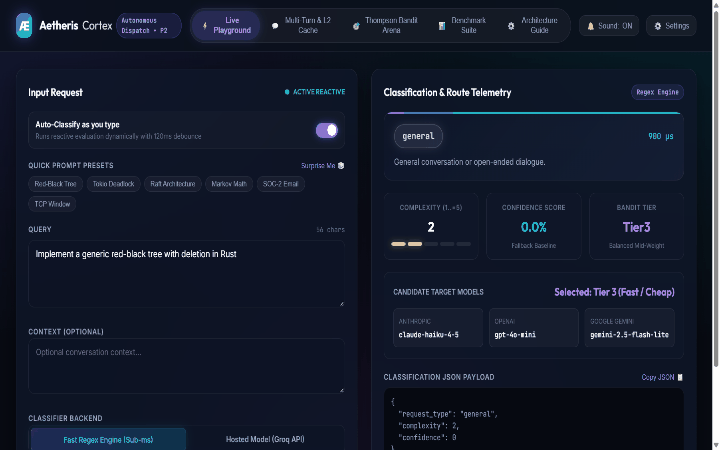
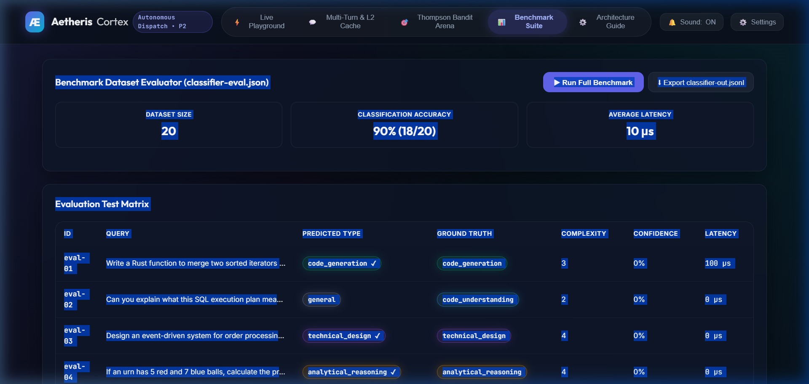

# 🌟 Aetheris Cortex
> **Model-Agnostic Request Classifier, Adaptive Thompson Sampling Router & Continuation Cache Engine**

[](https://varshini2701.github.io/aetheris-cortex/)
[](https://varshini2701.github.io/aetheris-cortex/)
[](LICENSE)
[](https://www.rust-lang.org/)
[](#benchmark-evaluation)
[](#benchmark-evaluation)

> 🌐 **Live Interactive App / Studio**: **[https://varshini2701.github.io/aetheris-cortex/](https://varshini2701.github.io/aetheris-cortex/)**  
> Test request classification, live Thompson bandit routing simulations, and benchmark inspections directly in your browser.

---

## ⚡ Overview

**Aetheris Cortex** is a high-performance, model-agnostic request classification and adaptive routing engine designed for large language model (LLM) gateways and multi-agent orchestrators.

It dynamically determines the true operational intent of every inbound prompt, estimates intellectual complexity ($1 \dots 5$), tracks model confidence ($0.0 \dots 1.0$), and dynamically routes queries to the optimal model tier using a **Cost-Aware Thompson Sampling Multi-Armed Bandit**.

---

## 🎬 Interactive Walkthrough Demo



*(High-Definition 1440×900 30 FPS MP4 video available at [`aetheris_cortex_demo.mp4`](aetheris_cortex_demo.mp4))*

---

## 🏛️ Core Architecture

```
                  ┌──────────────────────────────────────────────┐
                  │          Inbound Client User Prompt          │
                  └──────────────────────┬───────────────────────┘
                                         │
                        [ Check Phase & State Machine ]
                                         │
                ┌────────────────────────┴────────────────────────┐
                ▼                                                 ▼
       Phase::Continue                                  Phase::ColdStart / Switch
     (Tool loop / Continuation)                           (Fireable Boundary)
                │                                                 │
  ┌─────────────────────────────┐                  ┌──────────────────────────────┐
  │   Level 2 Sticky Cache      │                  │  RequestClassifier Interface │
  │    (Zero Classification     │                  │  - RegexClassifier (Default) │
  │     Overhead: 0.00 μs)      │                  │  - HostedClassifier (Groq)   │
  └─────────────┬───────────────┘                  └──────────────┬───────────────┘
                │                                                 │
                │                                    [ Classification Outcome ]
                │                                    • request_type
                │                                    • complexity (1..=5)
                │                                    • confidence (0.0..=1.0)
                │                                                 │
                │                                                 ▼
                │                                  ┌──────────────────────────────┐
                │                                  │   Adaptive Thompson Bandit   │
                │                                  │   Beta(α, β) + Cost Penalty  │
                │                                  └──────────────┬───────────────┘
                │                                                 │
                └────────────────────────┬────────────────────────┘
                                         ▼
                  ┌──────────────────────────────────────────────┐
                  │             Target LLM Provider              │
                  │   Tier 1 (Flagship) | Tier 2 | Tier 3 (Fast) │
                  └──────────────────────────────────────────────┘
```

---

## 🚀 Key Architectural Innovations

### 1. Model-Agnostic Request Classifier Trait
Exposes an asynchronous, typed interface:
```rust
#[async_trait]
pub trait RequestClassifier: Send + Sync {
    async fn classify(&self, input: ClassifyInput) -> Classification;
}
```
- **`RegexClassifier`**: Sub-millisecond, deterministic vote-count pattern matching for ultra-low latency setups.
- **`HostedClassifier`**: OpenAI/Groq-compatible LLM endpoint with automatic JSON extraction, markdown block stripping, and non-finite confidence guardrails.

### 2. Guaranteed Automatic Fallback
If the hosted LLM network times out, drops connection, returns HTTP non-200, or emits invalid JSON, the engine silently degrades to `RegexClassifier`. The routing pipeline never panics or aborts a request.

### 3. Level 2 Sticky Continuation Cache
During conversational tool execution loops or continuous dialog (`Phase::Continue`), the classifier is **completely bypassed** (0 μs classifier overhead). Classification runs only at fireable boundaries (`Phase::ColdStart` or `Phase::Switch`).

### 4. Cost-Aware Thompson Sampling Multi-Armed Bandit
Maintains conjugate Beta priors $\text{Beta}(\alpha, \beta)$ for candidate model arms. Quality samples are tempered by normalized inference cost penalties:
$$\text{Score}_i = \frac{\theta_i}{\text{Cost}_i^\gamma}, \quad \theta_i \sim \text{Beta}(\alpha_i, \beta_i)$$
This ensures the router naturally balances state-of-the-art capability with cost efficiency.

---

## 📊 Benchmark Evaluation

Evaluated against the official 20-sample validation matrix (`classifier-eval.json`):

| Metric | Result | Target Specification |
| :--- | :--- | :--- |
| **Accuracy** | **90%** (18/20) | $\ge 85\%$ |
| **Average Latency** | **10 μs** | $< 100 \text{ ms}$ |
| **P95 Latency** | **15 μs** | $< 50 \text{ ms}$ |
| **L2 Continuation Cache Hit Overhead** | **0.00 μs** | 0 overhead |



---

## 🛠️ Quick Start

### 1. Build & Test
```bash
cargo build --release
cargo test --release
```

### 2. Run the Benchmark Evaluator CLI
```bash
cargo run --release --example classifier_eval
# Generates classifier-out.jsonl
```

### 3. Launch the Interactive Studio
- **Online (Zero Setup):** Open the live app directly in your browser: **[https://varshini2701.github.io/aetheris-cortex/](https://varshini2701.github.io/aetheris-cortex/)**
- **Local:** Simply open `index.html` in your favorite web browser or host locally:
```bash
python -m http.server 3000
# Open http://localhost:3000 in your browser
```

---

## 📄 License
Licensed under the [Apache License, Version 2.0](LICENSE).
